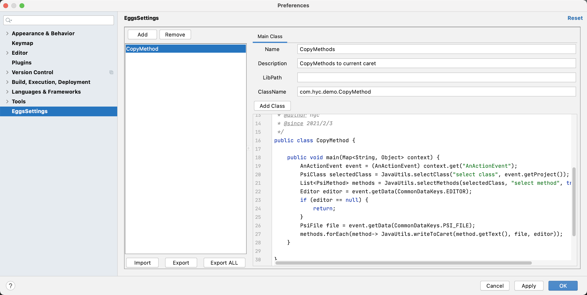
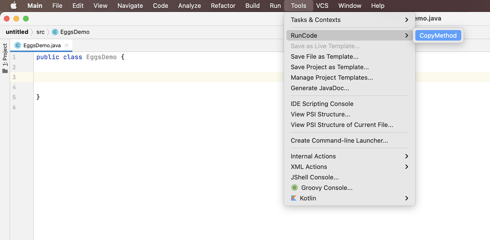
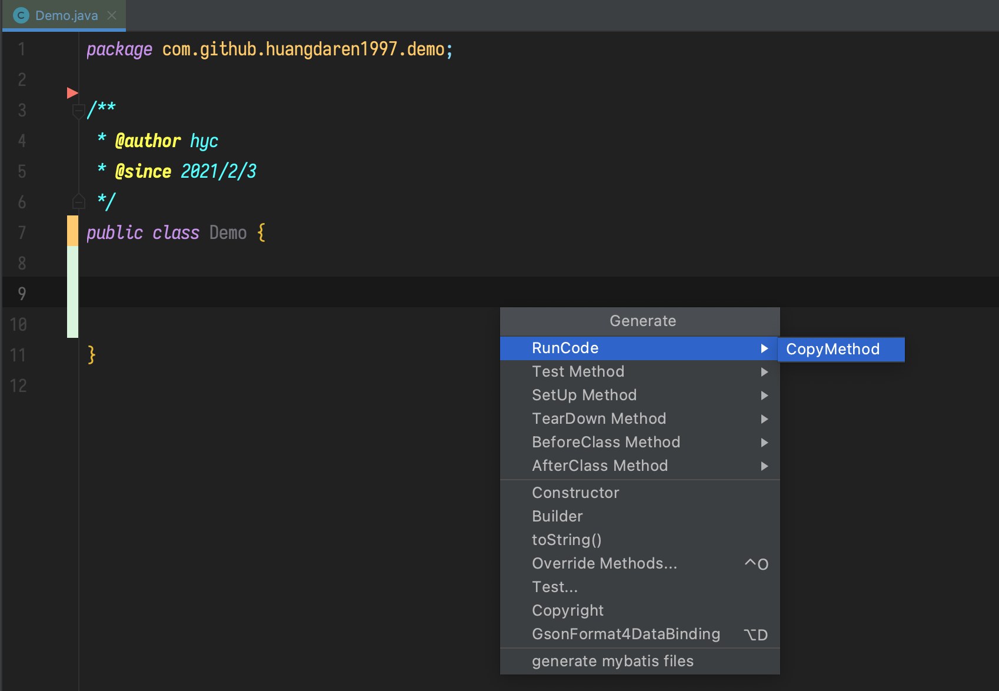
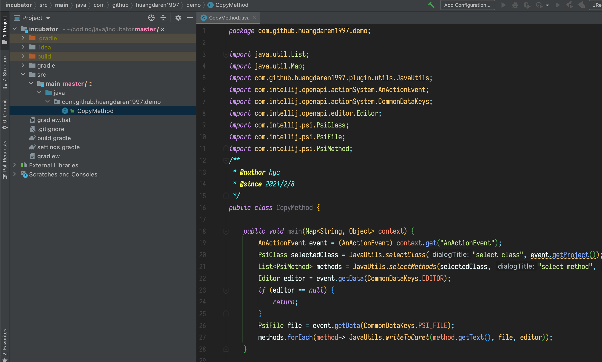

# Eggs

Eggs是一个强大的Intellij IDEA 插件，它允许你在运行时编写Java代码与IDEA进行交互，最终得到你想要的效果。

## TODO

- [x]  完善配置共享功能
- [ ] 提高执行单元的编写效率
    - [x]  发布Incubator项目
    - [ ]  Intellij IDEA API文档
- [ ]  完善使用文档
- [ ]  提高插件的稳定性
- [ ]  编写英文文档
- [ ]  提高插件性能

# Usage

下面这个例子展示了如何利用Eggs得到复制类方法到当前位置的能力。

## 编写执行单元

在`Settings`面板新增并编写执行单元，如下图



代码如下

```java
package com.hyc.demo;

import java.util.List;
import java.util.Map;
import JavaUtils;
import com.intellij.openapi.actionSystem.AnActionEvent;
import com.intellij.openapi.actionSystem.CommonDataKeys;
import com.intellij.openapi.editor.Editor;
import com.intellij.psi.PsiClass;
import com.intellij.psi.PsiFile;
import com.intellij.psi.PsiMethod;
/**
 * @author hyc
 * @since 2021/2/3
 */
public class CopyMethod {

    public void main(Map<String, Object> context) {
        AnActionEvent event = (AnActionEvent) context.get("AnActionEvent");
        PsiClass selectedClass = JavaUtils.selectClass("select class", event.getProject());
        List<PsiMethod> methods = JavaUtils.selectMethods(selectedClass, "select method", true, true);
        Editor editor = event.getData(CommonDataKeys.EDITOR);
        if (editor == null) {
            return;
        }
        PsiFile file = event.getData(CommonDataKeys.PSI_FILE);
        methods.forEach(method-> JavaUtils.writeToCaret(method.getText(), file, editor));
    }
    
}
```

## 运行执行单元





## 如何编写执行单元？我可以使用哪些类？

克隆 [Incubator](https://github.com/hexffff0/incubator) 项目，在该项目下编写你的执行单元（你可以使用所有你在该项目下能引用到的类）



# Installation

## 插件市场

- 目前还没发布到插件市场

## Releases

从[Releases](https://github.com/hexffff0/eggs/releases)页面下载

## 编译

克隆该项目，进入项目目录执行`./gradlew buildPlugin`，最后看到`BUILD SUCCESSFUL`即可，编译后插件存放在`./build/distributions`目录下

# License

``` 
Copyright 2021 com.github.hexffff0

    Licensed under the Apache License, Version 2.0 (the "License");
    you may not use this file except in compliance with the License.
    You may obtain a copy of the License at

      http://www.apache.org/licenses/LICENSE-2.0

    Unless required by applicable law or agreed to in writing, software
    distributed under the License is distributed on an "AS IS" BASIS,
    WITHOUT WARRANTIES OR CONDITIONS OF ANY KIND, either express or implied.
    See the License for the specific language governing permissions and
    limitations under the License.
```

